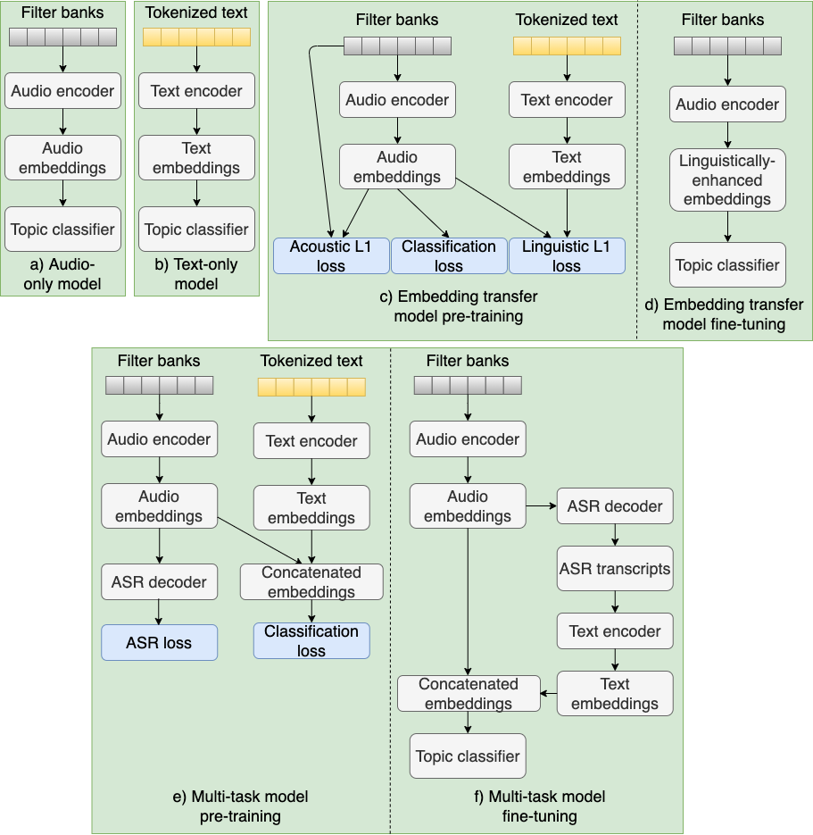

# Topic-identification-for-spontaneous-Finnish-speech

Implementation of the approaches used in the paper: "Topic identification for spontaneous speech: Enriching audio features with embedded linguistic information".

The models are implemented using the SpeechBrain toolkit and the recipes are available in the subdirectories.

An overview of the explored Topic ID systems is given in the figure below:

